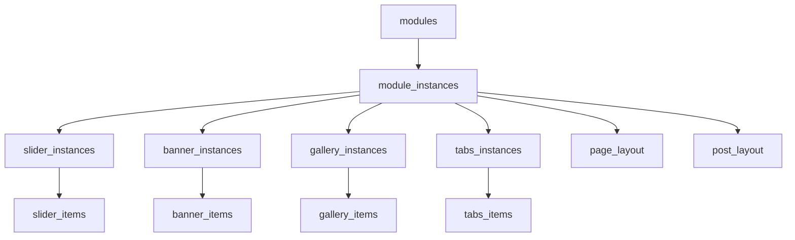

# Руководство по разработке модулей для TeamCMS

## Общее описание архитектуры модулей

Модульная система TeamCMS построена по следующей архитектуре:

1. **Module (Базовая модель)** - определяет тип модуля и его возможности
2. **ModuleInstance (Экземпляр)** - конкретная настроенная версия модуля
3. **Специфичные модели** - дополнительные таблицы для хранения данных модуля
4. **Python-класс** - логика обработки и управления модулем
5. **HTML-шаблоны** - интерфейс для создания/редактирования и отображения

## Архитектура базы данных



## Пошаговая инструкция создания нового модуля

### Шаг 1: Планирование модуля

Определите:
- **Название модуля** (например, "TestimonialModule")
- **Функциональность** (что должен делать модуль)
- **Поля данных** (какие данные нужно хранить)
- **Настройки** (какие параметры можно изменять)

**Пример**: Модуль "Отзывы клиентов"
- Название: TestimonialModule
- Функциональность: Отображение отзывов клиентов с фото, именем и текстом
- Поля: имя, фото, текст отзыва, рейтинг
- Настройки: количество отзывов на странице, стиль отображения

### Шаг 2: Создание моделей базы данных

#### 2.1. Создайте файл модели: `app/models/modules/testimonial.py`

```python
from ...extensions import db
from ..base import BaseModel

class TestimonialModuleInstance(BaseModel):
    """Экземпляр модуля отзывов, привязанный к ModuleInstance"""
    __tablename__ = 'testimonial_instances'

    id = db.Column(db.Integer, primary_key=True, autoincrement=True)
    module_instance_id = db.Column(db.Integer, db.ForeignKey('module_instances.id'), nullable=False, index=True)

    title = db.Column(db.String(255), nullable=False)
    max_items = db.Column(db.Integer, default=6)
    display_style = db.Column(db.String(50), default='grid')

    module_instance = db.relationship('ModuleInstance', backref=db.backref('testimonial_instance', uselist=False))

    def __repr__(self):
        return f"<TestimonialModuleInstance {self.title}>"


class TestimonialItem(BaseModel):
    """Отдельный отзыв"""
    __tablename__ = 'testimonial_items'

    id = db.Column(db.Integer, primary_key=True, autoincrement=True)
    testimonial_id = db.Column(db.Integer, db.ForeignKey('testimonial_instances.id'), nullable=False, index=True)

    customer_name = db.Column(db.String(255), nullable=False)
    customer_photo_id = db.Column(db.Integer, db.ForeignKey('images.id'), nullable=True)
    review_text = db.Column(db.Text, nullable=False)
    rating = db.Column(db.Integer, default=5)  # 1-5 звезд
    position = db.Column(db.String(255), nullable=True)  # Должность клиента
    company = db.Column(db.String(255), nullable=True)   # Компания клиента

    testimonial = db.relationship('TestimonialModuleInstance', 
                                 backref=db.backref('testimonials', lazy=True, cascade="all, delete"))
    customer_photo = db.relationship('Image', 
                                   foreign_keys=[customer_photo_id], 
                                   backref=db.backref('testimonial_photos', lazy=True))

    def __repr__(self):
        return f"<TestimonialItem {self.customer_name}>"
```

#### 2.2. Добавьте импорт в `app/models/modules/__init__.py`

```python
from .testimonial import TestimonialModuleInstance, TestimonialItem
```

#### 2.3. Создайте миграцию

```bash
flask db migrate -m "Add testimonial module"
flask db upgrade
```

### Шаг 3: Создание Python-класса логики

#### 3.1. Создайте файл: `app/admin/modules/testimonial.py`

```python
import json
from flask import flash, redirect, url_for
from ...extensions import db
from ...models.module import ModuleInstance
from ...models.modules.testimonial import TestimonialModuleInstance, TestimonialItem

class TestimonialModule:
    """Логика сохранения/загрузки экземпляра модуля отзывов"""

    @staticmethod
    def save_instance(module_id, form_data, instance_id=None):
        """Создание или обновление модуля отзывов"""
        
        if not module_id:
            flash("Ошибка: module_id не передан!", "danger")
            return redirect(url_for('admin.modules_list'))

        # Получаем или создаем ModuleInstance
        module_instance = ModuleInstance.query.get(instance_id) if instance_id else None
        
        if not module_instance:
            module_instance = ModuleInstance(
                module_id=module_id,
                settings=json.dumps({
                    'title': form_data.get("title"),
                    'max_items': int(form_data.get("max_items", 6)),
                    'display_style': form_data.get("display_style", "grid")
                }),
                selected_template="default"
            )
            db.session.add(module_instance)
            db.session.flush()
        else:
            # Обновляем настройки
            module_instance.settings = json.dumps({
                'title': form_data.get("title"),
                'max_items': int(form_data.get("max_items", 6)),
                'display_style': form_data.get("display_style", "grid")
            })

        # Получаем или создаем TestimonialModuleInstance
        testimonial_instance = TestimonialModuleInstance.query.filter_by(
            module_instance_id=module_instance.id
        ).first()
        
        if not testimonial_instance:
            testimonial_instance = TestimonialModuleInstance(
                module_instance_id=module_instance.id
            )
            db.session.add(testimonial_instance)
        else:
            # Удаляем старые отзывы
            TestimonialItem.query.filter_by(testimonial_id=testimonial_instance.id).delete()

        # Заполняем основные поля
        testimonial_instance.title = form_data.get("title", "Отзывы клиентов")
        testimonial_instance.max_items = int(form_data.get("max_items", 6))
        testimonial_instance.display_style = form_data.get("display_style", "grid")

        db.session.flush()

        # Обрабатываем отзывы
        testimonial_keys = [key for key in form_data.keys() if key.startswith('testimonials[')]
        testimonial_indices = list(set([
            key.split('[')[1].split(']')[0] for key in testimonial_keys
        ]))

        for idx in testimonial_indices:
            customer_name = form_data.get(f"testimonials[{idx}][customer_name]", "").strip()
            if not customer_name:
                continue

            # Безопасно конвертируем ID изображения
            try:
                photo_id = form_data.get(f"testimonials[{idx}][customer_photo_id]", "").strip()
                photo_id = int(photo_id) if photo_id and photo_id != "" else None
            except (ValueError, TypeError):
                photo_id = None

            try:
                rating = int(form_data.get(f"testimonials[{idx}][rating]", 5))
                rating = max(1, min(5, rating))  # Ограничиваем 1-5
            except (ValueError, TypeError):
                rating = 5

            item = TestimonialItem(
                testimonial_id=testimonial_instance.id,
                customer_name=customer_name,
                customer_photo_id=photo_id,
                review_text=form_data.get(f"testimonials[{idx}][review_text]", ""),
                rating=rating,
                position=form_data.get(f"testimonials[{idx}][position]", ""),
                company=form_data.get(f"testimonials[{idx}][company]", "")
            )
            db.session.add(item)

        db.session.commit()
        flash("Модуль «Отзывы» сохранён!", "success")
        return redirect(url_for('admin.create_or_edit_module_instance',
                               module_id=module_instance.module_id,
                               instance_id=module_instance.id))

    @staticmethod
    def load_instance_data(instance_id):
        """Загрузка данных для редактирования"""
        if not instance_id:
            return {
                'testimonial_instance': None,
                'testimonials': []
            }

        module_instance = ModuleInstance.query.get(instance_id)
        if not module_instance:
            return {
                'testimonial_instance': None,
                'testimonials': []
            }

        testimonial_instance = TestimonialModuleInstance.query.filter_by(
            module_instance_id=module_instance.id
        ).first()

        testimonials = TestimonialItem.query.filter_by(
            testimonial_id=testimonial_instance.id
        ).all() if testimonial_instance else []

        return {
            'testimonial_instance': testimonial_instance,
            'testimonials': testimonials
        }

    @staticmethod
    def get_instance_data(module_instance):
        """Получение данных для отображения на сайте"""
        if not module_instance:
            return {
                'settings': {},
                'testimonial_instance': None,
                'testimonials': []
            }

        settings = json.loads(module_instance.settings) if module_instance.settings else {}
        
        testimonial_instance = TestimonialModuleInstance.query.filter_by(
            module_instance_id=module_instance.id
        ).first()

        testimonials = TestimonialItem.query.filter_by(
            testimonial_id=testimonial_instance.id
        ).limit(testimonial_instance.max_items if testimonial_instance else 6).all() if testimonial_instance else []

        return {
            'settings': settings,
            'testimonial_instance': testimonial_instance,
            'testimonials': testimonials
        }
```

#### 3.2. Создайте файл для фронтенда: `app/views/modules/testimonial.py`

```python
import json
from ...models.module import ModuleInstance
from ...models.modules.testimonial import TestimonialModuleInstance, TestimonialItem

class TestimonialModule:
    """Логика для отображения модуля отзывов на фронтенде"""

    @staticmethod
    def get_instance_data(module_instance):
        """Получение данных для отображения на сайте"""
        if not module_instance:
            return {
                'settings': {},
                'testimonial_instance': None,
                'testimonials': []
            }

        settings = json.loads(module_instance.settings) if module_instance.settings else {}
        
        testimonial_instance = TestimonialModuleInstance.query.filter_by(
            module_instance_id=module_instance.id
        ).first()

        testimonials = TestimonialItem.query.filter_by(
            testimonial_id=testimonial_instance.id
        ).limit(testimonial_instance.max_items if testimonial_instance else 6).all() if testimonial_instance else []

        return {
            'settings': settings,
            'testimonial_instance': testimonial_instance,
            'testimonials': testimonials
        }
```

### Шаг 4: Создание HTML-шаблонов

#### 4.1. Шаблон админки: `app/templates/admin/modules/testimonial.html`

```html



<div class="container mt-4">
    <h1>Модуль отзывов</h1>

    <form method="POST">
        <input type="hidden" name="csrf_token" value="{{ csrf_token() }}"/>
        <input type="hidden" name="action" value="save_testimonial">

        <!-- Основные настройки -->
        <div class="row">
            <div class="col-md-6">
                <div class="mb-3">
                    <label for="title" class="form-label">Заголовок модуля</label>
                    <input type="text" name="title" id="title" class="form-control"
                           value="{{ testimonial_instance.title if testimonial_instance else 'Отзывы клиентов' }}" required>
                </div>
            </div>
            <div class="col-md-3">
                <div class="mb-3">
                    <label for="max_items" class="form-label">Максимум отзывов</label>
                    <input type="number" name="max_items" id="max_items" class="form-control"
                           value="{{ testimonial_instance.max_items if testimonial_instance else 6 }}" min="1" max="20">
                </div>
            </div>
            <div class="col-md-3">
                <div class="mb-3">
                    <label for="display_style" class="form-label">Стиль отображения</label>
                    <select name="display_style" id="display_style" class="form-control">
                        <option value="grid" selected>Сетка</option>
                        <option value="slider" selected>Слайдер</option>
                        <option value="list" selected>Список</option>
                    </select>
                </div>
            </div>
        </div>

        <!-- Отзывы -->
        <h3 class="mt-4">Отзывы</h3>
        <div id="testimonials-container">
            
            <div class="card mb-3 testimonial-item">
                <div class="card-body">
                    <h5 class="card-title">Отзыв {{ loop.index }}</h5>
                    <div class="row">
                        <div class="col-md-2">
                            <label class="form-label">Фото клиента</label>
                            <div class="selected-image" data-bs-toggle="modal" data-bs-target="#chooseImageModal"
                                 data-imagetype="testimonial-photo-{{ testimonial.id }}">
                                
                                
                                
                                <span class="text-muted btn-light">Выберите фото</span>
                                
                            </div>
                            <input type="hidden" name="testimonials[{{ testimonial.id }}][customer_photo_id]"
                                   value="{{ testimonial.customer_photo_id or '' }}">
                        </div>
                        <div class="col-md-2">
                            <label class="form-label">Имя клиента</label>
                            <input type="text" name="testimonials[{{ testimonial.id }}][customer_name]" class="form-control"
                                   value="{{ testimonial.customer_name }}" required>
                        </div>
                        <div class="col-md-2">
                            <label class="form-label">Должность</label>
                            <input type="text" name="testimonials[{{ testimonial.id }}][position]" class="form-control"
                                   value="{{ testimonial.position or '' }}">
                        </div>
                        <div class="col-md-2">
                            <label class="form-label">Компания</label>
                            <input type="text" name="testimonials[{{ testimonial.id }}][company]" class="form-control"
                                   value="{{ testimonial.company or '' }}">
                        </div>
                        <div class="col-md-1">
                            <label class="form-label">Рейтинг</label>
                            <select name="testimonials[{{ testimonial.id }}][rating]" class="form-control">
                                
                                <option value="{{ i }}" selected>{{ i }} ⭐</option>
                                
                            </select>
                        </div>
                        <div class="col-md-2">
                            <label class="form-label">Текст отзыва</label>
                            <textarea name="testimonials[{{ testimonial.id }}][review_text]" class="form-control" rows="3" required>{{ testimonial.review_text }}</textarea>
                        </div>
                        <div class="col-md-1 d-flex align-items-end">
                            <button type="button" class="btn btn-danger delTestimonial">
                                <i class="bi bi-trash"></i>
                            </button>
                        </div>
                    </div>
                </div>
            </div>
            
        </div>

        <button type="button" class="btn btn-secondary mt-3" onclick="addTestimonial()">Добавить отзыв</button>
        <button type="submit" class="btn btn-primary mt-3">Сохранить</button>
    </form>
</div>



<script>
document.addEventListener('DOMContentLoaded', function () {
    const chooseImageModal = document.getElementById('chooseImageModal');

    if (chooseImageModal) {
        chooseImageModal.addEventListener('show.bs.modal', function (event) {
            const button = event.relatedTarget;
            window.currentImageType = button.getAttribute('data-imagetype');
        });
    }
});

function addTestimonial() {
    const container = document.getElementById('testimonials-container');
    const testimonialIndex = container.children.length;

    const testimonialHTML = `
        <div class="card mb-3 testimonial-item">
            <div class="card-body">
                <h5 class="card-title">Новый отзыв</h5>
                <div class="row">
                    <div class="col-md-2">
                        <label class="form-label">Фото клиента</label>
                        <div class="selected-image" data-bs-toggle="modal" data-bs-target="#chooseImageModal" 
                             data-imagetype="testimonial-photo-${testimonialIndex}">
                            <span class="text-muted btn-light">Выберите фото</span>
                        </div>
                        <input type="hidden" name="testimonials[${testimonialIndex}][customer_photo_id]">
                    </div>
                    <div class="col-md-2">
                        <label class="form-label">Имя клиента</label>
                        <input type="text" name="testimonials[${testimonialIndex}][customer_name]" class="form-control" required>
                    </div>
                    <div class="col-md-2">
                        <label class="form-label">Должность</label>
                        <input type="text" name="testimonials[${testimonialIndex}][position]" class="form-control">
                    </div>
                    <div class="col-md-2">
                        <label class="form-label">Компания</label>
                        <input type="text" name="testimonials[${testimonialIndex}][company]" class="form-control">
                    </div>
                    <div class="col-md-1">
                        <label class="form-label">Рейтинг</label>
                        <select name="testimonials[${testimonialIndex}][rating]" class="form-control">
                            <option value="5" selected>5 ⭐</option>
                            <option value="4">4 ⭐</option>
                            <option value="3">3 ⭐</option>
                            <option value="2">2 ⭐</option>
                            <option value="1">1 ⭐</option>
                        </select>
                    </div>
                    <div class="col-md-2">
                        <label class="form-label">Текст отзыва</label>
                        <textarea name="testimonials[${testimonialIndex}][review_text]" class="form-control" rows="3" required></textarea>
                    </div>
                    <div class="col-md-1 d-flex align-items-end">
                        <button type="button" class="btn btn-danger delTestimonial">
                            <i class="bi bi-trash"></i>
                        </button>
                    </div>
                </div>
            </div>
        </div>
    `;

    container.insertAdjacentHTML("beforeend", testimonialHTML);
}

document.addEventListener('click', function (event) {
    if (event.target.classList.contains('delTestimonial')) {
        event.target.closest('.testimonial-item').remove();
    }
});
</script>


```

#### 4.2. Шаблон фронтенда: `app/templates/front/extations/testimonialmodule.html`

```html
<div class="testimonials-module py-5">
    <div class="container">
        
        <h2 class="text-center mb-5">{{ testimonial_instance.title }}</h2>
        

        
        <div class="row">
            
            <div class="col-md-4 mb-4">
                <div class="testimonial-card h-100 p-4 border rounded shadow-sm">
                    <div class="d-flex align-items-center mb-3">
                        
                        
                        
                        <div>
                            <h5 class="mb-0">{{ testimonial.customer_name }}</h5>
                            
                            <small class="text-muted">{{ testimonial.position }}</small>
                            
                            
                            <div><small class="text-muted">{{ testimonial.company }}</small></div>
                            
                        </div>
                    </div>
                    <div class="mb-2">
                        
                        <span class="text-warning">⭐</span>
                        
                    </div>
                    <p class="testimonial-text">{{ testimonial.review_text }}</p>
                </div>
            </div>
            
        </div>

        
        <div id="testimonialSlider" class="carousel slide" data-bs-ride="carousel">
            <div class="carousel-inner">
                
                <div class="carousel-item active">
                    <div class="text-center">
                        
                        
                        
                        <h5>{{ testimonial.customer_name }}</h5>
                        
                        <p class="text-muted">{{ testimonial.position }}, {{ testimonial.company }}</p>
                        
                        <div class="mb-3">
                            
                            <span class="text-warning">⭐</span>
                            
                        </div>
                        <blockquote class="blockquote">
                            <p>"{{ testimonial.review_text }}"</p>
                        </blockquote>
                    </div>
                </div>
                
            </div>
            <button class="carousel-control-prev" type="button" data-bs-target="#testimonialSlider" data-bs-slide="prev">
                <span class="carousel-control-prev-icon" aria-hidden="true"></span>
            </button>
            <button class="carousel-control-next" type="button" data-bs-target="#testimonialSlider" data-bs-slide="next">
                <span class="carousel-control-next-icon" aria-hidden="true"></span>
            </button>
        </div>

        
        <!-- Список -->
        
        <div class="testimonial-list-item mb-4 p-4 border rounded">
            <div class="row align-items-center">
                
                <div class="col-auto">
                    
                </div>
                
                <div class="col">
                    <h5>{{ testimonial.customer_name }}</h5>
                    
                    <p class="text-muted mb-1">{{ testimonial.position }}, {{ testimonial.company }}</p>
                    
                    <div class="mb-2">
                        
                        <span class="text-warning">⭐</span>
                        
                    </div>
                    <p class="mb-0">{{ testimonial.review_text }}</p>
                </div>
            </div>
        </div>
        
        
    </div>
</div>
```

### Шаг 5: Регистрация модуля в базе данных

Выполните SQL-команду для добавления записи в таблицу `modules`:

```sql
INSERT INTO modules (name, settings_schema, templates, creation_template) VALUES (
    'TestimonialModule',
    JSON_OBJECT(
        'title', JSON_OBJECT('type', 'string', 'default', 'Отзывы клиентов', 'required', true),
        'max_items', JSON_OBJECT('type', 'integer', 'default', 6, 'min', 1, 'max', 20),
        'display_style', JSON_OBJECT('type', 'select', 'options', JSON_ARRAY('grid', 'slider', 'list'), 'default', 'grid')
    ),
    JSON_ARRAY('default', 'compact', 'modern'),
    'testimonial.html'
);
```

### Шаг 6: Создание команды для инициализации модуля

Создайте файл: `app/commands/init_testimonial_module.py`

```python
from app.extensions import db
from app.models.module import Module
import json

def init_testimonial_module():
    """Создание модуля отзывов в базе данных"""
    
    # Проверяем, существует ли уже модуль
    existing_module = Module.query.filter_by(name='TestimonialModule').first()
    if existing_module:
        print("Модуль TestimonialModule уже существует")
        return

    # Создаем новый модуль
    testimonial_module = Module(
        name='TestimonialModule',
        settings_schema=json.dumps({
            'title': {
                'type': 'string',
                'default': 'Отзывы клиентов',
                'required': True
            },
            'max_items': {
                'type': 'integer',
                'default': 6,
                'min': 1,
                'max': 20
            },
            'display_style': {
                'type': 'select',
                'options': ['grid', 'slider', 'list'],
                'default': 'grid'
            }
        }),
        templates=json.dumps(['default', 'compact', 'modern']),
        creation_template='testimonial.html'
    )
    
    db.session.add(testimonial_module)
    db.session.commit()
    
    print("Модуль TestimonialModule успешно создан!")

if __name__ == "__main__":
    from app import create_app
    app = create_app()
    with app.app_context():
        init_testimonial_module()
```

### Шаг 7: Тестирование

1. **Запустите миграцию**:
   ```bash
   flask db migrate -m "Add testimonial module"
   flask db upgrade
   ```

2. **Инициализируйте модуль**:
   ```bash
   python app/commands/init_testimonial_module.py
   ```

3. **Проверьте работу**:
   - Перейдите в админку → Модули
   - Найдите "TestimonialModule"
   - Создайте экземпляр модуля
   - Добавьте несколько отзывов
   - Проверьте отображение на фронтенде

## Дополнительные файлы

### Обновление `app/__init__.py`

Добавьте импорт новых моделей:

```python
from .models.modules.testimonial import TestimonialModuleInstance, TestimonialItem
```

### CSS стили для модуля

Создайте файл: `app/static/css/modules/testimonial.css`

```css
.testimonials-module .testimonial-card {
    transition: transform 0.3s ease;
}

.testimonials-module .testimonial-card:hover {
    transform: translateY(-5px);
}

.testimonials-module .testimonial-text {
    font-style: italic;
    line-height: 1.6;
}

.testimonials-module .carousel-item {
    padding: 2rem;
}

.testimonials-module .testimonial-list-item {
    background: #f8f9fa;
}
```

## Контрольный список

- [ ] ✅ Модели базы данных созданы
- [ ] ✅ Миграции выполнены
- [ ] ✅ Python-класс логики создан
- [ ] ✅ HTML-шаблоны созданы
- [ ] ✅ Модуль зарегистрирован в БД
- [ ] ✅ Импорты добавлены в `__init__.py`
- [ ] ✅ CSS стили созданы
- [ ] ✅ Тестирование выполнено

## Полезные советы

1. **Именование**: Всегда используйте суффикс "Module" в названии класса
2. **Безопасность**: Всегда проверяйте входящие данные и используйте `try-except` блоки
3. **Производительность**: Добавляйте индексы для часто используемых полей
4. **Расширяемость**: Планируйте возможность добавления новых полей в будущем
5. **Документация**: Комментируйте сложную логику

## Структура файлов модуля

```
├── app/
│   ├── models/modules/
│   │   └── testimonial.py          # Модели БД
│   ├── admin/modules/
│   │   └── testimonial.py          # Логика админки
│   ├── views/modules/
│   │   └── testimonial.py          # Логика фронтенда
│   ├── templates/
│   │   ├── admin/modules/
│   │   │   └── testimonial.html    # Шаблон админки
│   │   └── front/extations/
│   │       └── testimonialmodule.html  # Шаблон фронтенда
│   ├── static/css/modules/
│   │   └── testimonial.css         # Стили модуля
│   └── commands/
│       └── init_testimonial_module.py  # Команда инициализации
```

Этот пример показывает полный процесс создания модуля "Отзывы клиентов". Аналогично можно создавать любые другие модули, следуя этой же архитектуре. 