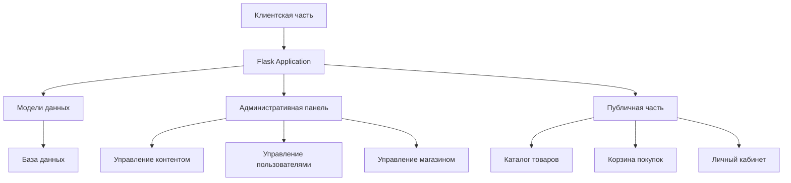
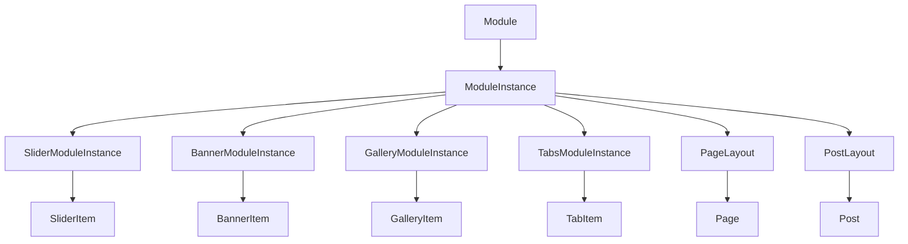

# TeamCMS - Документация проекта

## Общее описание
TeamCMS - это система управления контентом (CMS) с интегрированным функционалом электронной коммерции. Проект построен на Python с использованием Flask framework и предоставляет широкий спектр возможностей для управления контентом и продажами.

## Архитектура проекта

### Основные компоненты

## Функциональные модули

### 1. Система аутентификации и авторизации
- Регистрация и авторизация пользователей
- Ролевая модель доступа
- Управление правами пользователей
- Аудит действий пользователей

### 2. Управление контентом
- Страницы и посты
- Медиа-галерея
- Баннеры и слайдеры
- Меню и навигация
- SEO-настройки для страниц

### 3. Каталог товаров
- Категории товаров
- Атрибуты и характеристики товаров
- Вариации товаров
- Управление ценами и остатками
- Поиск и фильтрация товаров

### 4. Корзина и заказы
- Корзина покупок
- Оформление заказа
- Промокоды и скидки
- История заказов
- Система доставки
- Налоговые расчеты

### 5. Клиентские функции
- Личный кабинет
- Избранные товары
- Сравнение товаров
- Отзывы и рейтинги
- Реферальная система

### 6. Административные функции
- Управление складом
- Управление заказами
- Управление пользователями
- Настройки магазина
- Управление регионами доставки

### 7. Модульная система
- **Динамические модули**: расширяемая система для создания новых блоков контента
- **Готовые модули**: Slider, Banner, Gallery, ProductTab (вкладки с товарами)
- **Конструктор страниц**: размещение модулей в сетке Bootstrap
- **Настройки модулей**: JSON-схемы для гибкой конфигурации
- **Шаблоны отображения**: несколько вариантов дизайна для каждого модуля
- **Руководство разработчика**: подробная инструкция в `docs/module_development_guide.md`

### 8. Дополнительные модули
- Система уведомлений
- Интеграция с платежными системами
- Управление темами оформления
- Аналитика и отчеты

## Технический стек

### Backend
- Python/Flask
- SQLAlchemy ORM
- Alembic (миграции)
- JWT для аутентификации

### Frontend
- HTML5/CSS3
- JavaScript/jQuery
- Bootstrap
- TinyMCE (редактор)
- Select2
- Swiper

### База данных
- Поддержка различных SQL баз данных
- Миграции через Alembic

## Структура моделей данных

### Основные модели
1. User - пользователи системы
2. Role - роли пользователей
3. Product - товары
4. Category - категории
5. Order - заказы
6. Customer - клиенты
7. Page - страницы
8. Post - публикации
9. Module - модули системы
10. ModuleInstance - экземпляры модулей

### Архитектура модулей

### Вспомогательные модели
1. Image - изображения
2. SeoSettings - SEO настройки
3. AuditLog - лог действий
4. Cart - корзина
5. Wishlist - избранное
6. Review - отзывы
7. ProductAttribute - атрибуты товаров

## API и интеграции

### REST API
- Аутентификация
- Управление товарами
- Управление заказами
- Пользовательские операции

### Внешние интеграции
- Платежные системы
- Системы доставки
- Экспорт/импорт данных

## Безопасность
- Защита от CSRF
- Валидация форм
- Безопасное хранение паролей
- Ролевой доступ к функциям
- Аудит действий пользователей

## Масштабируемость
- Модульная архитектура
- Возможность расширения функционала
- Кастомизация через темы
- Поддержка плагинов

## Требования к установке
- Python 3.x
- База данных SQL
- Веб-сервер с поддержкой WSGI
- Необходимые зависимости из requirements.txt 